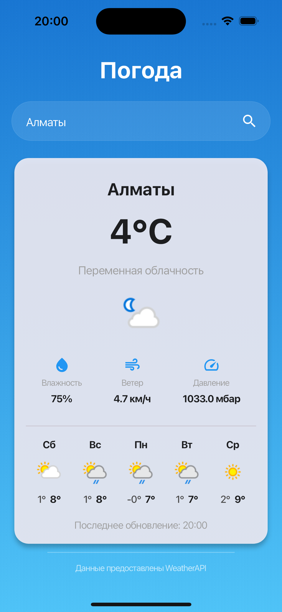

# Weather App

**Weather App** — это кроссплатформенное приложение, созданное на Flutter. Приложение использует API от [WeatherAPI](https://www.weatherapi.com/) для получения данных.

---

## 🚀 Основные функции

- 📍 Отображение текущей погоды для указанного города.
- 🌦 Прогноз на 5 дней с дневной и ночной температурой.
- ⏱ Автоматическое обновление данных каждую минуту.

---

## 🛠 Используемые технологии

- **[Flutter](https://flutter.dev/):** Фреймворк для кроссплатформенной разработки.
- **[WeatherAPI](https://www.weatherapi.com/):** API для получения погодных данных.
- **[Bloc](https://bloclibrary.dev/):** Управление состоянием в приложении.
- **[intl](https://pub.dev/packages/intl):** Форматирование даты и времени.
- **Clean Architecture:** Архитектурный подход для разделения ответственности и удобства масштабирования проекта.

---
## 📦 Установка и настройка

1. Клонируйте репозиторий:
   ```bash
   git clone https://github.com/samalss/WeatherApp.git
   ```

2. Перейдите в папку проекта:
   ```bash
   cd WeatherApp
   ```

3. Установите зависимости:
   ```bash
   flutter pub get
   ```

4. Настройте API-ключ:
   - Откройте файл `lib/core/constants/api_constants.dart`.
   - Замените строку `'your_api'` на ваш реальный API-ключ.

5. Запустите приложение:
   ```bash
   flutter run
   ```

---

## 📂 Структура проекта

```plaintext
WeatherApp/
├── lib/
│   ├── config/                # Routes, Theme
│   ├── core/                  # Constants, Utils
│   ├── weather/               # Основная функциональность
│   │   ├── data/              # Repository, Models
│   │   ├── domain/            # Use cases, Entities
│   │   ├── presentation/      # Bloc, Screens, Widgets
│   ├── main.dart              
├── pubspec.yaml               # Зависимости Flutter
└── README.md                  # Описание проекта
```

## 🖼 Скриншоты

### Главный экран

